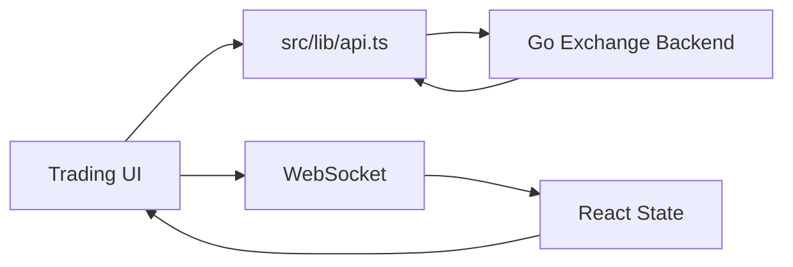
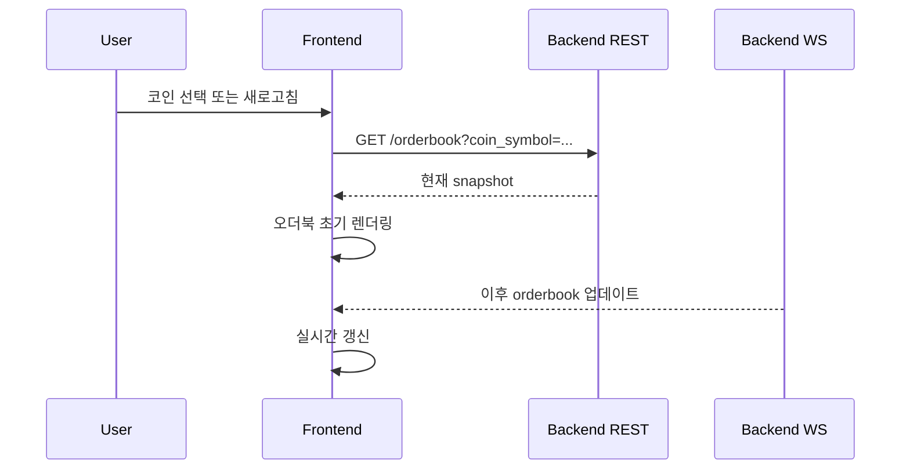

# Go Exchange Frontend

Go Exchange Backend와 연동되는 실시간 가상자산 거래소 MVP 프론트엔드입니다.
회원가입, 로그인, 개발용 자산 충전, 지정가/시장가 주문, 주문 취소, 지갑/주문/체결 조회, 오더북과 체결 스트림 표시를 제공합니다.

프론트엔드는 거래 화면에서 사용자가 실제 거래소와 비슷한 흐름을 따라가며 주문, 체결, 잔고 변화를 확인할 수 있도록 구성했습니다.

## 핵심 기능

| 영역 | 구현 내용 |
| --- | --- |
| 인증 UI | 회원가입, 로그인, 로그아웃, JWT 저장 |
| 계정 패널 | KRW/코인 available, locked, 총 보유량, 평균매수가, 평가손익 표시 |
| 개발용 충전 | 로컬 시연용 KRW/선택 코인 fund 버튼 |
| 주문 폼 | 지정가/시장가 BUY/SELL, decimal string 전송 |
| 주문 정책 | 백엔드 market rules 기반 tick size, 수량 step, 주문 타입 검증 |
| 주문 목록 | open order 표시, 주문 취소 |
| 체결 내역 | 사용자 체결, 수수료 asset, 체결 가격/수량 표시 |
| 오더북 | REST snapshot으로 초기 동기화, WebSocket으로 실시간 갱신 |
| 실시간 체결 | WebSocket trade 메시지 기반 체결 내역 갱신 |
| WebSocket 재연결 | exponential backoff 기반 reconnect helper |
| E2E 검증 | Playwright로 거래 핵심 시나리오 검증 |

## 기술 스택

- React 18.3.1
- TypeScript 5.8.3
- Vite 5.4.19
- Tailwind CSS 3.4.17
- shadcn/Radix UI components
- TanStack React Query 5.83.0
- React Router 6.30.1
- Recharts 2.15.4
- Vitest 3.2.4
- Playwright 1.57.0

## 실행 방법

백엔드가 `http://localhost:8080`에서 실행 중이어야 합니다.

`.env.local` 예시:

```text
VITE_API_BASE_URL=http://localhost:8080
VITE_WS_URL=ws://localhost:8080/ws
VITE_ENABLE_DEV_TOOLS=true
VITE_DEV_TOOLS_TOKEN=<local-dev-tools-token>
```

개발 서버:

```powershell
npm install
npm run dev
```

브라우저에서 `http://localhost:3000`을 엽니다.

## 백엔드 연동 구조



HTTP API:

- `POST /auth/register`
- `POST /auth/login`
- `GET /markets/rules?coin_symbol=BTC`
- `GET /orderbook?coin_symbol=BTC`
- `POST /orders`
- `DELETE /orders/:id`
- `GET /orders`
- `GET /wallets`
- `GET /trades`
- `POST /dev/wallets/fund`

WebSocket:

- `GET /ws`
- `orderbook` 메시지로 선택 코인의 호가를 갱신합니다.
- `trade` 메시지로 실시간 체결 흐름을 갱신합니다.

프론트엔드는 금액과 수량을 `number`로 변환해 전송하지 않고 decimal string으로 백엔드에 전달합니다.
백엔드에서 받은 decimal string도 화면 표시 단계에서만 포맷팅합니다.

## 오더북 동기화

오더북은 REST snapshot과 WebSocket stream을 함께 사용합니다.



이 구조로 사용자가 늦게 접속하거나 새로고침해도 이미 올라와 있는 주문을 화면에서 바로 확인할 수 있습니다.

## 개발용 지갑 충전

로컬 시연에서는 실제 입출금 대신 개발용 fund API를 사용합니다.

프론트:

```text
VITE_ENABLE_DEV_TOOLS=true
VITE_DEV_TOOLS_TOKEN=<local-dev-tools-token>
```

백엔드:

```text
GOEXCHANGE_ENABLE_DEV_TOOLS=true
GOEXCHANGE_DEV_TOOLS_TOKEN=<local-dev-tools-token>
```

두 token이 다르면 `POST /dev/wallets/fund`가 실패합니다.

## 테스트

단위 테스트:

```powershell
npm test -- --run
```

Lint:

```powershell
npm run lint
```

Build:

```powershell
npm run build
```

E2E:

```powershell
npm run test:e2e
```

E2E는 로컬 백엔드가 먼저 실행되어 있어야 합니다.
자세한 내용은 [E2E.md](E2E.md)를 참고하세요.

## E2E 주요 검증 시나리오

- 회원가입, 로그인, JWT 인증 흐름
- KRW/코인 개발용 충전
- 지정가 매수 주문 생성과 취소
- 지정가 매도와 매수 체결
- 시장가 매수와 시장가 매도 체결
- 자기 체결 방지
- 부분 체결 후 주문 취소와 locked balance release
- 가격 개선 환급
- 수수료 표시
- 평균매수가 계산과 전량 매도 후 reset
- market rules API 기반 주문 정책 반영
- 인증 오류와 dev token 보호
- 중복 취소 시 locked balance 이중 release 방지
- 오더북 REST snapshot 초기 동기화
- WebSocket 기반 실시간 갱신

## 로컬 시연 흐름

1. 백엔드를 `go run ./cmd`로 실행합니다.
2. 프론트엔드를 `npm run dev`로 실행합니다.
3. 계정 A와 계정 B를 만듭니다.
4. 계정 A에는 코인을, 계정 B에는 KRW를 충전합니다.
5. 계정 A가 지정가 매도 주문을 올립니다.
6. 계정 B에서 같은 코인을 선택해 오더북 snapshot이 보이는지 확인합니다.
7. 계정 B가 지정가 또는 시장가 매수로 체결합니다.
8. 양쪽 계정의 지갑, 주문 목록, 체결 내역, 오더북 변화를 확인합니다.
